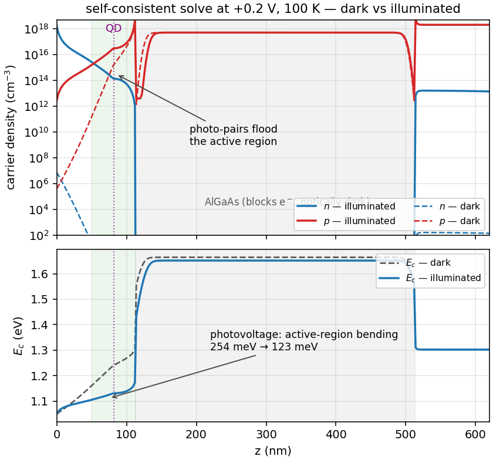
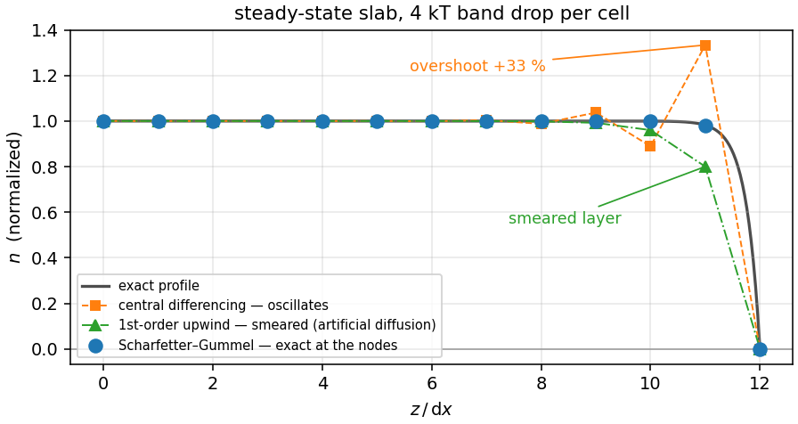

# SpinPD

One-dimensional band and self-consistent transport simulation for layered semiconductor devices.

This repository provides a compact Python implementation for solving electrostatic band profiles and steady-state photo-carrier transport in a user-defined one-dimensional layer stack. The code was developed for vertical photodiode structures, but the core band solver is not limited to one specific device architecture: the layer sequence, materials, doping, thicknesses, contacts, illumination direction, and operating bias can be modified in `spinpd/stack.py`.

The modeling focus is:

- nonlinear Poisson solution for equilibrium band edges under applied bias;
- optical generation in absorbing layers, optionally with spin-resolved generation under circular excitation;
- electron and hole continuity equations using Scharfetter-Gummel discretization, with spin-resolved electron populations when the spin-current observable is evaluated;
- self-consistent Gummel iteration coupling Poisson, transport, and recombination;
- bias-dependent carrier extraction and recombination in layered semiconductor stacks;
- macroscopic spin-current observables evaluated on top of the converged transport solution.

The contact extraction used by the transport solver is a scalar phenomenological boundary condition for carrier collection. The spin-current calculation is an effective observable-level model: circular excitation can generate different spin populations, the transport equation solves the spin-resolved electron populations on the converged self-consistent band, and the reported currents include `I_plus`, `I_minus`, `I_dc`, and `I_spin = I_plus - I_minus`. The effective parameters are generation polarization, spin lifetime, and current-asymmetry; they are not a microscopic contact calculation.

## Visual overview

The self-consistent transport calculation resolves how illumination changes the carrier density and band profile in the layer stack:



The transport discretization uses Scharfetter-Gummel fluxes to remain stable across strong band gradients:



## Core modules

```text
spinpd/
  assets/            README figures
  bands.py           nonlinear Poisson solver for equilibrium band profiles
  config.py          constants, units, and simulation settings
  materials.py       semiconductor material parameters
  observables.py     bias sweeps, dc current, and spin-current observables
  plotting.py        diagnostic plotting helpers
  recombination.py   radiative, SRH, Auger, and localized-capture recombination
  run.py             basic command-line driver
  stack.py           layer-stack, material, doping, contact, and device definitions
  transport.py       optical generation and Scharfetter-Gummel helper functions
  transport_sc.py    self-consistent Poisson/transport/recombination solver
  tunneling.py       scalar contact-extraction boundary condition
```

## Numerical model

For a layer stack mapped onto a one-dimensional grid, the equilibrium solver computes the electrostatic potential and band edges from nonlinear Poisson equations with position-dependent material parameters and doping.

Under illumination, the self-consistent solver iterates:

1. Poisson update for the electrostatic potential;
2. Scharfetter-Gummel electron and hole continuity solves;
3. recombination-rate update from the local carrier densities;
4. convergence check on the carrier profiles.

This captures carrier-induced band flattening and the resulting bias dependence of photocurrent and recombination in layered photodiode structures.

For spin-resolved observables, the converged electrostatic and recombination profiles are reused. The code then solves coupled spin-resolved electron continuity equations with opposite circular-excitation source terms for `sigma+` and `sigma-`, and reports the helicity current difference as `I_spin`.

## Requirements

- Python 3.11 or newer
- `numpy >= 1.24`
- `scipy >= 1.10`
- `matplotlib >= 3.7`

Minimal setup:

```bash
python -m venv .venv
source .venv/bin/activate
python -m pip install numpy scipy matplotlib
```

Equivalent installation from the dependency file:

```bash
python -m pip install -r requirements.txt
```

Run commands from the repository root so that Python can import the local `spinpd` package.

## Quick start

```bash
python -m spinpd.run
```

This creates an `outputs/` directory with diagnostic plots for the default layer stack:

- equilibrium band profiles at selected biases;
- carrier-density profiles under illumination;
- dc photocurrent as a function of applied bias.
- macroscopic spin-current observable as a function of applied bias.

## Example: calculate equilibrium band profiles

```bash
python - <<'PY'
import numpy as np
from spinpd.bands import solve_equilibrium
from spinpd.stack import baseline_device

device = baseline_device()
biases = [-0.4, -0.2, 0.0, 0.2, 0.4]

for bias in biases:
    profile = solve_equilibrium(device, T=100, dx=1.0, bias_V=bias)
    out = np.column_stack([profile.z, profile.Ec, profile.Ev])
    filename = f"band_edges_{bias:+.1f}V.csv".replace("+", "p").replace("-", "m")
    np.savetxt(
        filename,
        out,
        delimiter=",",
        header="z_nm,Ec_eV,Ev_eV",
        comments="",
    )
    print(filename)
PY
```

Each output file contains the depth coordinate `z_nm`, conduction-band edge `Ec_eV`, and valence-band edge `Ev_eV`.

## Example: run a self-consistent bias sweep

```bash
python - <<'PY'
import numpy as np
from spinpd.observables import bias_sweep_sc
from spinpd.stack import baseline_calibrated

device = baseline_calibrated()
biases = np.linspace(-0.6, 0.7, 66)

sweep = bias_sweep_sc(
    device,
    biases,
    T=100,
    dx=2.0,
    phiB_sigma=0.12,
    intensity_scale=200.0,
)

out = np.column_stack([
    sweep.V,
    sweep.I_dc,
    sweep.I_spin,
    sweep.eta_internal,
    sweep.iterations,
    sweep.residual,
])

np.savetxt(
    "bias_sweep.csv",
    out,
    delimiter=",",
    header="bias_V,I_dc_A,I_spin_A,eta_internal,iterations,residual",
    comments="",
)

print("bias_sweep.csv")
print(f"minimum current bias = {sweep.minimum_current_bias():+.3f} V")
print(f"maximum spin current = {np.nanmax(sweep.I_spin):.3e} A")
PY
```

## Modifying the layer stack

The default layer-stack definitions are in `spinpd/stack.py`:

- `baseline_device()` defines a nominal layered photodiode example;
- `baseline_calibrated()` adjusts the example device to a calibrated operating configuration.

To model another structure, copy one of these functions and edit the layer sequence, thicknesses, materials, doping densities, contact parameters, pump settings, or recombination parameters.

## Citation and license

Please cite the archived software release corresponding to the version used for a calculation. Citation metadata is provided in `CITATION.cff`.

This code is distributed under the MIT License; see `LICENSE`.
